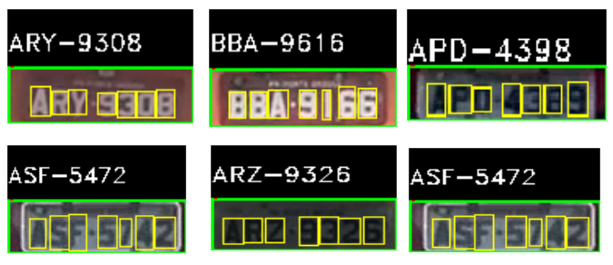

# Detecção de placa de carro em dois estágios usando YoLov4 tiny 

Etapa inicial de um sistema **ALPR - Automatic License Plate Recognition** (Detecção da placa). 

**Dataset utilizado**: UFPR-ALPR (LAROCA et al. 2018) -  maior dataset público de imagens de placas no padrão brasileiro (antigo). É um dataset com 4500 imagens de 150 veículos diferentes (carros, motos, caminhões e ônibus). Placas cinzas e placas vermelhas. 

A detecção da placa é feita em dois estágios: 

1. Detecção do veículo: um modelo yolov4 tiny treinado para detecção de uma única classe (veículo) faz a detecção do veículo na imagem de entrada. 

2. Detecção da placa: também um modelo yolov4 tiny faz a detecção da placa do veículo recebendo como entrada o veículo detectado no estágio anterior (em caso da etapa anterior detectar mais de um veículo escolhemos apenas aquele com maios confidence score, se mais de uma placa for detectada em um veículo também escolhemos apenas aquela com maior confidence score). Foi treinado com imagens recortadas dos veículos do dataset. 

A pipeline de detecção da placa em dois estágios (primeiro veículo e depois a placa dentro da detecção do veículo) já foi utilizada com êxito anteriormente (LAROCA et al. 2018), (SILVA e JUNG, 2017), (GONÇALVES et al. 2017). A pipeline usada neste repositório se baseia no trabalho de LAROCA et al. 2018. Também foi experimentada a detecção em um único estágio (un único modelo yolov4 tiny para fazer detecção da placa diretamente) mas esse modelo obteve um recall muito baixo (0.58), essa abordagem de um estágio pode ser aprimorada talvez com a utilização da yolov4 em sua versão não tiny.  

Após a detecção da placa, um terceiro modelo, também yolov4 tiny que detecta apenas uma classe (caractere), detecta dentro da detecção da placa as bounding boxes dos caracteres, essa pipeline está implementada no arquivo **char_detection.py**. Um próximo estágio, ainda não implementado, fará o reconhecimento dos caracteres dentro dessas detecções. 

Além da detecção dos caracteres para posterior reconhecimento, também foi treinada uma YoLov4 tiny com 36 classes 0-9 A-Z. Esse modelo faz a detecção das bounding boxes e classificação dos caracteres em um só estágio. Essa abordagem está implementada no arquivo **alpr.py**. 

O treinamento dos modelos foi feito usando GPU  no Google Colab (serviço de nuvem
gratuito hospedado pelo Google) e o framework Darknet (REDMON, 2013-2016). O notebook usado no treinamento dos modelos está disponível neste repositório: 
> **ufpr_alpr_yolov4_tiny.ipynb**

## Dependências
* opencv-contrib-python

>Obs: dependências apenas pra execução da detecção (não inclui dependências do treinamento)

## Utilização

Para executar a detecção e reconhecimento dos caractéres (Carro, depois placa e depois modelo treinado com 36 classes 0-9 e A-Z) **alpr.py**: 
> python3 alpr.py --image test --vehicle_model models/model-veiculos/ --plate_model models/model-placas-cropped/ ---char_model models/model-alfanumerico

* --image: caminho para a pasta com as imagens. 
* --vehicle_model: caminho pra pasta com os pesos da yolo treinada pra detectar o veículo. 
* --plate_model: caminho pra pasta com os pesos da yolo treinada para detectar a placa.
* --char_model: caminho pra pasta com os pesos da yolo treinada para detectar os caracteres da placa.

* apertar 'q' para sair, 'a' para voltar uma imagem e qualquer outra tecla pra avançar. 

------------------

Para executar a detecção dos caractéres (Carro, depois placa e depois caracteres) **char_detection.py**: 
> python3 char_detection.py --image test --vehicle_model models/model-veiculos/ --plate_model models/model-placas-cropped/ --char_model models/model-caracteres

* --image: caminho para a pasta com as imagens. 
* --vehicle_model: caminho pra pasta com os pesos da yolo treinada pra detectar o veículo. 
* --plate_model: caminho pra pasta com os pesos da yolo treinada para detectar a placa.
* --char_model: caminho pra pasta com os pesos da yolo treinada para detectar os caracteres da placa.

* apertar 'q' para sair, 'a' para voltar uma imagem e qualquer outra tecla pra avançar. 

------------------

**yolo_detection.py** pode ser usado para visualização da detecção de cada estágio:
1. Exemplo detecção do veículo: 
> python3 yolo_detection.py --image test --yolo models/model-veiculos/ --label vehicle

2. Exemplo detecção da placa: 
> python3 yolo_detection.py --image test --yolo models/model-placas-cropped/ --label plate

* --image: caminho para a pasta com as imagens.

* --yolo: caminho pra pasta com os pesos da yolo treinada. 

* --label: pode ser 'vehicle' caso queira visualizar as detecções dos veículos ou plate pra visualizar a detecção da placa (passar a imagem ja cortada com apenas o veículo)

* apertar 'q' para sair, 'a' para voltar uma imagem e qualquer outra tecla pra avançar para próxima imagem. 

## Resultados

### Estágio 1 - Detecção veículo

| Conjunto | mAP @0.50 | Precisão |  Recall  | IOU     |
|:--------:|:---------:|:--------:|:--------:|---------|
|   Train  |  100.00 % | 100.00 % | 100.00 % | 91.54 % |
|    Val   |  99.39 %  |  93.00 % |  99.00%  | 82.07 % |
|   Test   |  99.68 %  |  97.00 % |  100.00% | 86.28 % |

--------------

### Estágio 2 - Detecção placa

| Conjunto | mAP @0.50 | Precisão |  Recall  | IOU     |
|:--------:|:---------:|:--------:|:--------:|---------|
|   Train  |  100.00 % | 100.00 % | 100.00 % | 85.38 % |
|    Val   |  100.00 % | 100.00 % | 100.00 % | 83.94 % |
|   Test   |  99.74 %  |  97.00 % |  100.00% | 81.31 % |

--------------

### Detecção dos caracteres da placa (classe caractere)

| Conjunto | mAP @0.50 | Precisão |  Recall  | IOU     |
|:--------:|:---------:|:--------:|:--------:|---------|
|   Train  |  99.99 %  | 100.00 % | 100.00 % | 88.71 % |
|    Val   |  99.96 %  |  99.00 % | 100.00 % | 85.39 % |
|   Test   |  99.97 %  | 100.00 % |  100.00% | 86.07 % |

--------------

### Detecção e classificação dos caracteres da placa (36 classes 0-9 A-Z)

| Conjunto | mAP @0.50 | Precisão |  Recall  | IOU     |
|:--------:|:---------:|:--------:|:--------:|---------|
|   Train  |  99.99 %  | 100.00 % | 100.00 % | 83.57 % |
|    Val   |  88.67 %  |  88.00 % |  89.00 % | 85.39 % |
|   Test   |  85.88 %  |  88.00 % |  89.00 % | 72.19 % |

----------------

>**Todas as detecções usaram um confidence threshold de 0.25. Também foi experimento o confidence score de 0.1, os resultados com esse valor podem ser vistos no notebook de treinamento**

## //TODO
Implementar sistema ALPR: 
- [x] Implementar detecção da placa
- [x] Detecção dos caracteres da placa detectada. 
- [x] Detecção dos caracteres e classificação usando apenas um modelo. 
- [ ] Reconhecimento dos caracteres da placa. 
- [ ] Redundância temporal. 

## Referências
1. LAROCA, Rayson et al. A robust real-time automatic license plate recognition based on the YOLO detector. In: 2018 international joint conference on neural networks (ijcnn). IEEE, 2018. p. 1-10.

2. SILVA, Sergio Montazzolli; JUNG, Claudio Rosito. Real-time brazilian license plate detection and recognition using deep convolutional neural networks. In: 2017 30th SIBGRAPI conference on graphics, patterns and images (SIBGRAPI). IEEE, 2017. p. 55-62.

3. GONÇALVES, Gabriel Resende; MENOTTI, David; SCHWARTZ, William Robson. License plate recognition based on temporal redundancy. In: 2016 IEEE 19th International Conference on Intelligent Transportation Systems (ITSC). IEEE, 2016. p. 2577-2582.

4. J. Redmon, “Darknet: Open source neural networks in C,” http://pjreddie.com/darknet/, 2013–2016.
